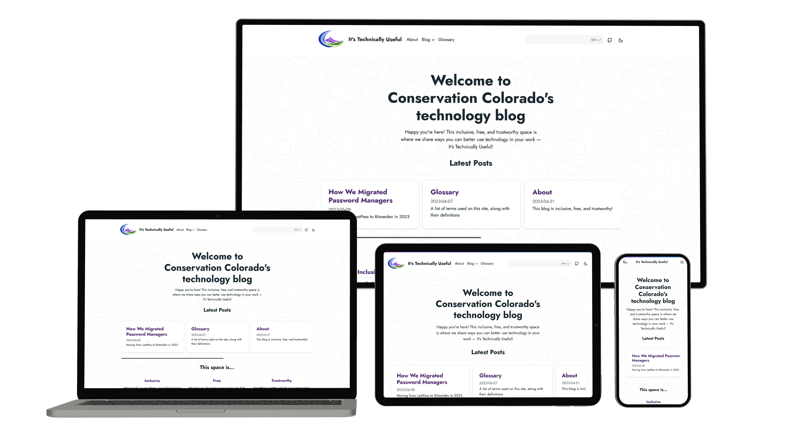

<div align="center">

[](https://github.com/ConservationColorado/conservationcolorado.github.io/actions/workflows/node.js-ci.yml)
[](https://github.com/ConservationColorado/conservationcolorado.github.io/actions/workflows/hugo-build-and-deploy.yml)

</div>

# Conservation Colorado's Technology Blog

<div align="center">



</div>

Welcome! This repository contains code for Conservation Colorado's technology blog,
[tech.conservationco.org](https://tech.conservationco.org).

We use this inclusive, free, and trustworthy space to share ways you can better use technology in your work.
We also showcase ways we solve problems within the organization using software engineering and technology!

This site is built using HTML, SCSS, JavaScript, and Hugo (Doks starter theme).

## Running the site locally

To run the site locally in a development environment, first, clone this repository:

```shell
git clone git@github.com:ConservationColorado/conservationcolorado.github.io      # over SSH
git clone https://github.com/ConservationColorado/conservationcolorado.github.io  # over HTTPS
```

Then, you'll want to install its dependencies using `npm`:

```shell
npm install
```

Finally, to start the server locally on `http://localhost:1313`, use the `npm start` script:

```shell
npm run start
```

> **Note** If you already have a server listening on `:1313`, Hugo will
[select another random available port](https://gohugo.io/commands/hugo_server/). Check your console output
for more details.

## Deployment

The latest revision of the site is built and deployed automatically on push to `main`. It's available online at
[tech.conservationco.org](https://tech.conservationco.org)!

## Creating pages

### Blog posts

To create a blog post, run the `npm create` script:

```shell
npm run create blog/your-post-title/index.md
```

All English blog posts are stored in the `./content/en/blog/` directory.

### Glossary entries

To create a glossary entry, run the `npm create` script:

```shell
npm run create glossary/your-glossary-entry.md
```

All English glossary entries are stored in the `./content/en/glossary/` directory

To include that glossary entry with a hoverable tooltip in text, use the following
[shortcode](https://gohugo.io/content-management/shortcodes/) in a Markdown file:

```golang

```
