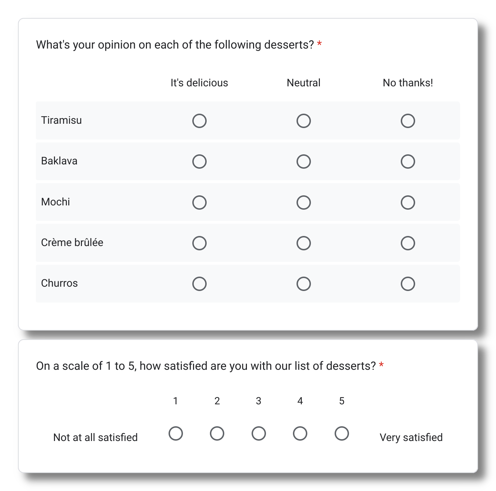



Forms are a great way to standardize how people deliver information to you. But which
tool is right for what you're doing?

In this article, I'll compare and contrast [Google Forms](https://forms.google.com)
and [Asana Forms](https://asana.com/guide/help/premium/forms) to help you decide which
to use for your next project.

## TL;DR, which form tool should I use?

Use this general-purpose flowchart to help you decide whether Google Forms or Asana Forms is
right for your use case.


---

title: Which form tool should you use to gather input?

---
%%{
  init: {
    'theme': 'base',
    'themeVariables': {
      'primaryColor': '#C4D7A4',
      'lineColor': '#A1A1A1',
      'arrowheadColor': 'A1A1A1'
    }
  }
}%%
flowchart TD
  subgraph bg[Start here]
    resp  -->|Yes| google0[Google Forms]
    resp  -->|No| files
    files -->|Yes| sign
    files -->|No| data
    data  -->|Record-keeping| google1[Google Forms]
    data  -->|Actionable steps| asana0[Asana Forms]
    sign  -->|No| asana1[Asana Forms]
    sign  -->|Yes| google2[Google Forms]
  end

  resp[Is it important to limit each user to one response?]
  files[Will users of your form need to upload files?]
  sign[OK if users have to sign into Google to submit the form?]
  data[What will you use your data for?]


## About Google Forms

Google Forms works with Google's spreadsheet tool, [Sheets](https://sheets.google.com) out
of the box. This makes Google Forms a great tool for keeping *records* of information.
Some classic use cases are collecting RSVPs, survey responses, and user feedback.

### When to use it

When you have lots of survey-oriented questions, Google Forms has your back. Multiple choice
grids and linear scales (see example below!) make it easy to present questions with multipart
answers. While you can represent these questions in Asana Forms as well, Google Forms is the more
elegant way to design a complicated questionnaire.

When you need to ask lots of questions, you'll also appreciate the more advanced page and section
controls available in Google's form tool.

Finally, if you want more control over design, Google Forms has more customizability than its Asana
counterpart, with the ability to change fonts, backgrounds, and theme colors.

## About Asana Forms

One of the best features of Asana Forms is that you can tie them to
[Custom Fields](https://asana.com/guide/help/premium/custom-fields). These make it
easy to link data across multiple projects and track data across the organization.

Unlike Google Sheets, where you can convert responses into rows in a spreadhseet, Asana Form
responses are automatically collected as *tasks* in the project that form belongs to. This gives
you all the advantages of Asana tasks, especially centralized due date and assignee tracking.

### When to use it

Use Asana Forms when a response to that form represents something *actionable*, for example, a
request for work, a todo item, or topic for later discussion.

You can optionally add the form submitter as a collaborator, which is great for keeping them in
the loop about how that work is going.

If you need to track data across multiple forms easily, and those forms have similar questions,
you should use Asana Forms with those repeat questions set up as
[global custom fields](https://asana.com/guide/help/premium/custom-fields#gl-global).
